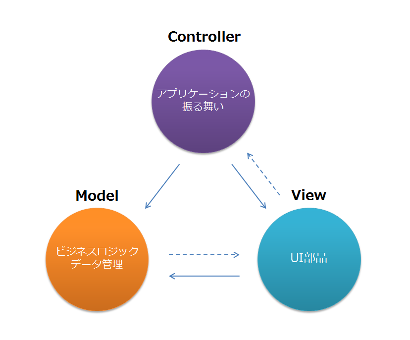

## そもそもMVCパターンって？



プログラミングする上でのクラスモデリング（構成構想）。アプリケーションが持つ3つの要素を `Model, View, Controller` に分離する。GUIを持たないアプリケーション（バッチやコマンドラインアプリケーションなど）はViewが存在しないので適用されない。

[hijiriworld Web - MVCモデルの概念を漫画で解説してみる](http://hijiriworld.com/web/mvc-concept/)

### MVCパターンにする理由

* 各レイヤー層を分離することで、保守性・可読性を向上させる。

```例: 扱うデータが新しく増えたとしても、その影響をアプリケーション全体に波及させることなく最小限の修正で済むようにする。→保守性の向上```

* ほかのレイヤーの仕様を知らなくてもアプリケーションを変更できる→属人性の軽減、詳しくなくてもアプリケーションの改修を行いやすくなる。

```例: アプリケーションのデザインを変更したいとき、内部的なロジックを理解していなくても他レイヤーに影響を与えずにView(見た目)だけを変更できる```

## MVVM(Model - View - ViewModel)


[Wikipedia - Model View ViewModel](https://ja.wikipedia.org/wiki/Model_View_ViewModel)

双方向データバインディングが行えるプラットフォーム（Angularなど）と相性がよく、それが出来ないプラットフォームと相性が悪い。この特性上、意識的にこのパターンを選択するというよりプラットフォームにより自動的にこのパターンが選択されるケースが多いと思われる。

* ViewはINPUT/OUTPUTを担う。データバインディングがあるプラットフォーム前提である感が強いので、ViewModelの内容を自動描画するのが仕事。
* ViewModelは描画のための状態の保持・ViewからのINPUTをModelへ変換するのが仕事。ここの変更はViewに(バインディングにより)自動的に反映される。
* Modelはそれ以外のすべて。Viewの情報(styleなど)を保持したりしてもよい。